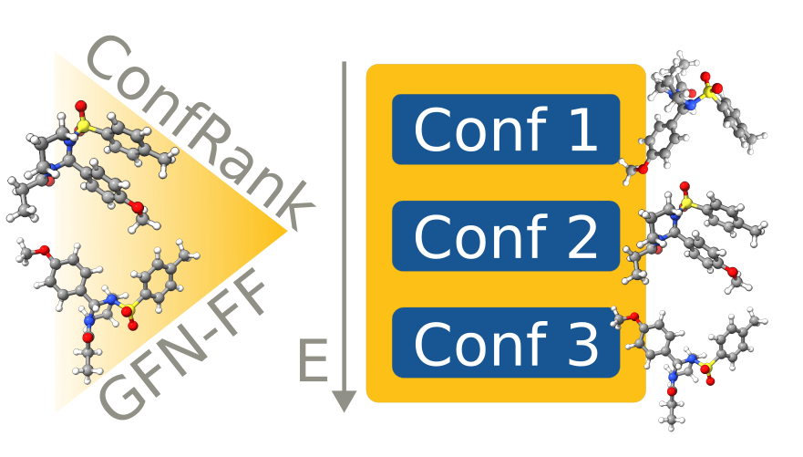

# ConfRank

[](https://www.python.org)
[](https://github.com/psf/black)

This is the official repository of the `ConfRank` project developed by the [Grimme](https://www.chemie.uni-bonn.de/grimme) and [Fraunhofer SCAI-VMD](https://www.scai.fraunhofer.de/en/business-research-areas/virtual-material-design.html) groups in Bonn.


<div align="center">

</div>


# Software Setup

You can create the environment using the following command:

```bash
bash setup_environment.sh
```

To activate the virtual environment simply run:

```bash
conda activate confrank
```
The current setup is tested with python version 3.11.5 and CUDA 11.8.


# Data

The data is available under: [https://zenodo.org/records/13354132](https://zenodo.org/records/13354132)


# Citations

When using or referencing to the `ConfRank` project please cite:
- **tbd**
  

# License

[![CC BY NC 4.0][cc-by-nc-image]][cc-by-nc]

This work is licensed under a
[Creative Commons Attribution-NonCommercial 4.0 International License][cc-by-nc].


[cc-by-nc]: http://creativecommons.org/licenses/by-nc/4.0/
[cc-by-nc-image]: https://i.creativecommons.org/l/by-nc/4.0/88x31.png
